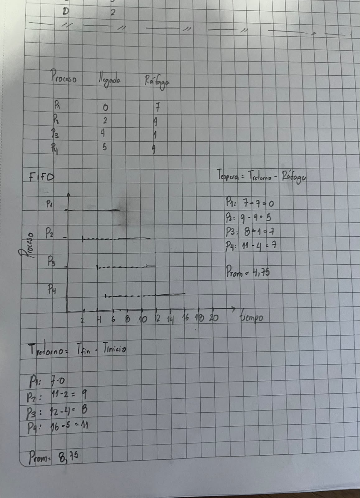
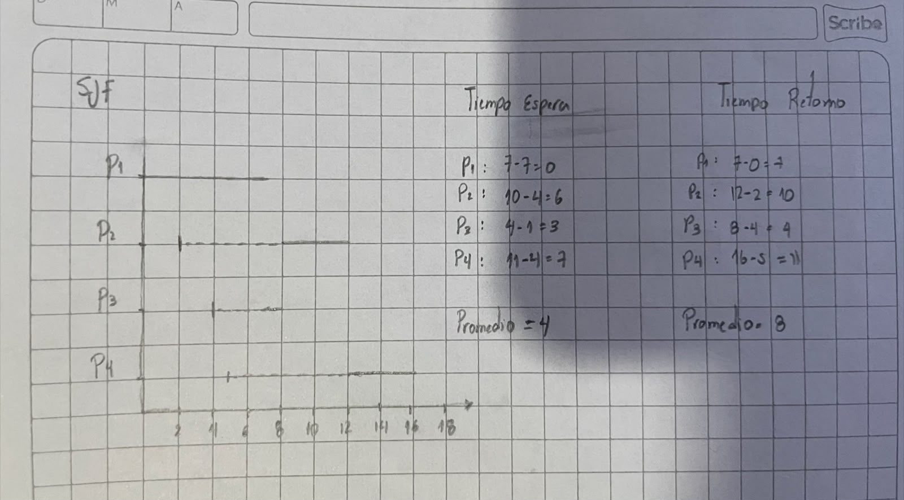
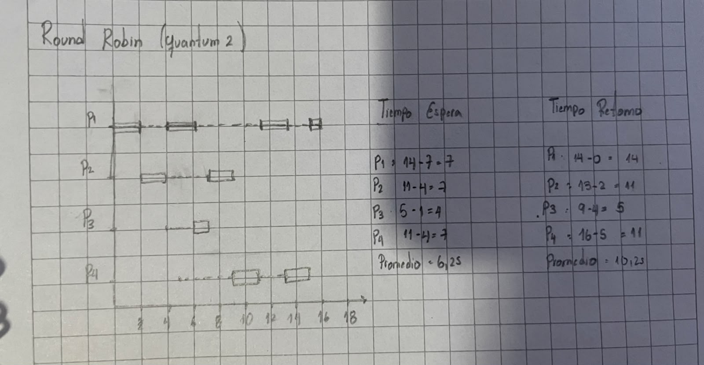
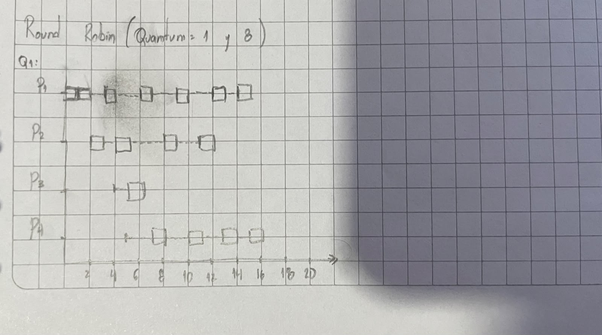
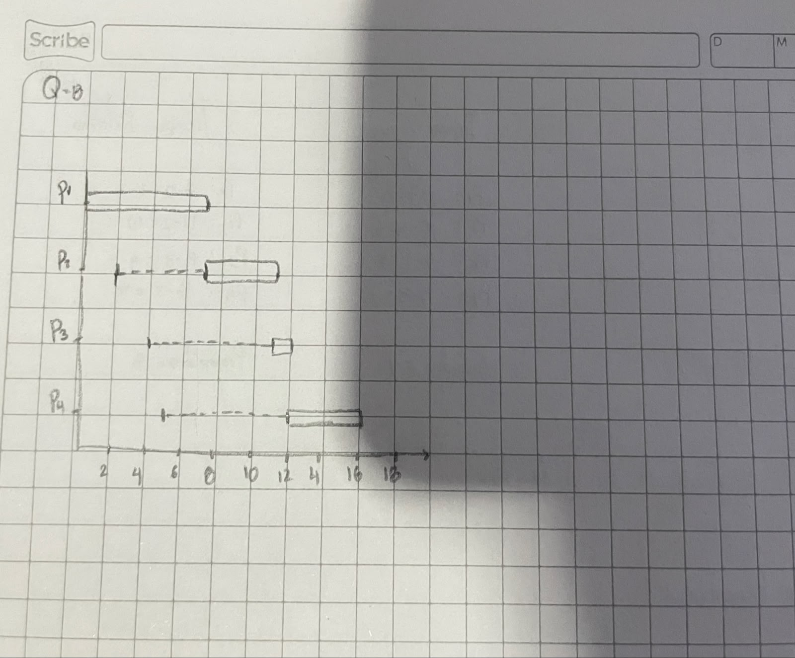

# Taller: planificación de procesos

Laboratorio de Sistemas Operativos.

**Objetivo:** resolver a mano la planificación de un conjunto de procesos con
FIFO, SJF no expropiativo y Round Robin, comparar sus resultados y observar en
el sistema real cómo se reparte el procesador.

Las respuestas de los puntos 3, 4 y 6 están en [bitacora.md](bitacora.md).
La guía original está en [Planificacion.pdf](Planificacion.pdf).

## Contenido del repositorio

| Archivo | Descripción |
|---|---|
| `Planificacion.pdf` | Guía del taller |
| `README.md` | Diagramas de Gantt y tablas de tiempos (primera parte) |
| `bitacora.md` | Respuestas de los puntos 3, 4, 5 y 6 |
| `capturas/` | Fotos de la resolución a mano |

## Datos del problema

| Proceso | Llegada | Ráfaga |
|:-------:|:-------:|:------:|
| P1 | 0 | 7 |
| P2 | 2 | 4 |
| P3 | 4 | 1 |
| P4 | 5 | 4 |

## Fórmulas y convenciones

- **Tiempo de retorno** = tiempo de finalización − tiempo de llegada
- **Tiempo de espera** = tiempo de retorno − ráfaga (solo el tiempo en la cola
  de listos; **no** incluye la ejecución)
- Si dos procesos empatan (misma ráfaga en SJF, o mismo instante en la cola),
  se respeta el **orden de llegada**.
- En Round Robin, el proceso interrumpido vuelve **al final** de la cola. Si un
  proceso llega en el mismo instante en que otro agota su quantum, el que llega
  entra a la cola primero.
- No se considera el costo del cambio de contexto.

---

## 1. FIFO (FCFS)

## 2. SJF no expropiativo

## 3. Round Robin, quantum = 2

## 4. Round Robin, quantum = 1 y quantum = 8

### Quantum = 1

### Quantum = 8

Como ninguna ráfaga supera 8, ningún proceso es interrumpido y el resultado es
idéntico a FIFO.
